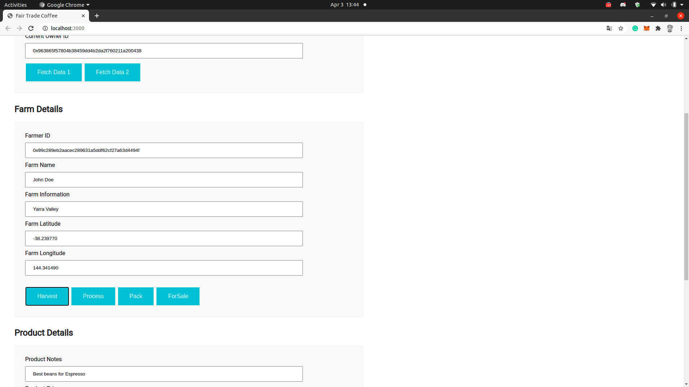
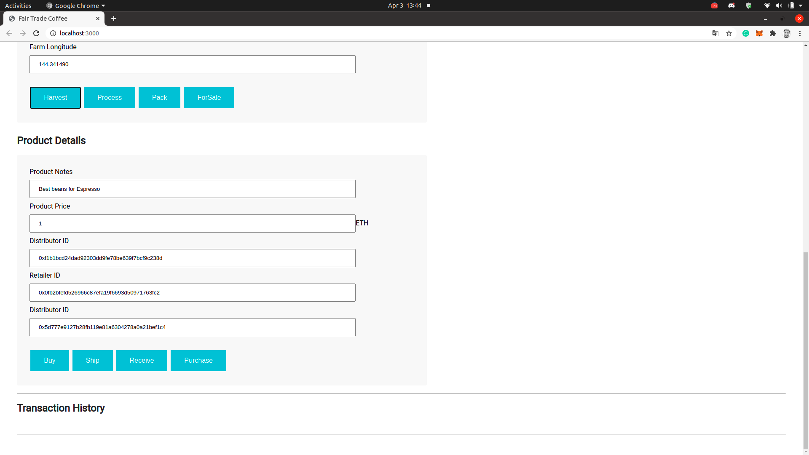
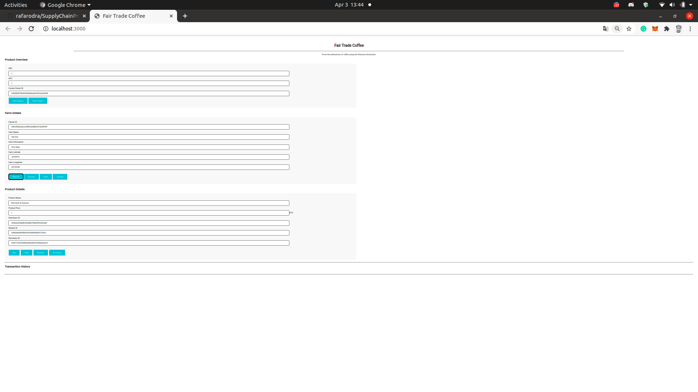
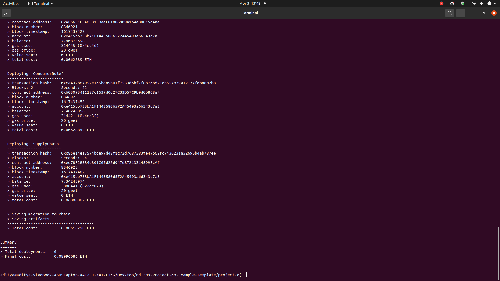

# Supply chain & data auditing

This Project is quite important in Blockchain Udacity Course. this project focuses on supply chain project, that helps to track item in the suppy chain.
The DApp User Interface when running should look like...

Credits : all the UML Diagrams have been drawn using Draw.io Application, that follows the similar structure for all diagrams. 









Your terminal should look something like this:



This will create the smart contract artifacts in folder ```build\contracts```.

Migrate smart contracts to the locally running blockchain, ganache-cli:


In a separate terminal window, launch the DApp:

```
npm run dev
```
## Contract Address

# Farm Role : 0x9BA8161E315752121063AeBfD7D8966520a8343c
# Distributor Role : 0x0700D6C4a6416591Fd5e06362f2C873D0791b578
# Retailer Role : 0xAF66FCE3A0FD150aeF810869D9a1b4a08815d4ae
# Consumer Role : 0x603093411187c1637d0d27C33D57C9b9d0D8C8aF
# Supply Chain : 0xed78F283B4e801C67d286947d87213314599EcAf

## Built With

* [Ethereum](https://www.ethereum.org/) - Ethereum is a decentralized platform that runs smart contracts

to make the web faster, safer, and more open.
* [Truffle Framework](http://truffleframework.com/) - Truffle is the most popular development framework for Ethereum with a mission to make your life a whole lot easier.
* [Draw.io](https://draw.io/) - Used to make all the diagrams

